# Streamerbot Plugin
Let your stream play the iconic "**YOU DIED**" animation when your character dies, have your Twitch chatbot track 
your boss kill counts, or set up something simple like a death count tracker overlay.

This plugin lets _Old School RuneScape_ interact with your stream. It does this by
letting [**Streamerbot**](https://streamer.bot/) perform actions
via HTTP requests upon events happening in the game, using notifiers
from [**Dink**](https://github.com/pajlads/DinkPlugin/tree/master).

## What is Streamerbot?

Streamerbot is a versatile, locally run and open-source tool used for streaming. It connects various streaming
platforms such as Twitch, broadcasting software like OBS, among many other integrations to perform
automated tasks for your streams. You can think of applications such as

- Sending messages to Twitch Chat with your own chatbot
- Controlling OBS Studio to play your own alerts locally
- Posting messages to Discord
- Playing text-to-speech Audio with [**Speaker.bot**](https://speaker.bot/)
- Running custom C# code to perform more advanced tasks

In a nutshell, Streamerbot can do whatever you want it to do automatically, whenever you want.
If you're new to Streamerbot, I recommend learning about its basic building 
blocks. [**Click here**](https://docs.streamer.bot/get-started/introduction) for an introduction to the fundamentals of Streamerbot.

## Basic Setup

Using this plugin with Streamerbot requires both the Streamerbot application with an active HTTP Server and the 
Dink Plugin to be running. 

### Setting up Streamerbot

1. Download and install the Streamerbot application, using
   the [**Installation Guide**](https://docs.streamer.bot/get-started/installation).
2. Connect your Streamerbot to your broadcasting software and streaming platform(s) of choice, using
   the [**Initial Setup Guide**](https://docs.streamer.bot/get-started/setup).
3. Set up your Streamerbot to receive HTTP
   requests: [**HTTP Server Configuration guide**](https://docs.streamer.bot/api/http/guide/configuration). You can leave
   the  **Address** as the default `127.0.0.1`.
   and the **Port** as the default `7474` for our use case, unless you have to use a different address for some reason.
   Enable **Auto Start** for future use and simply press `⏻ Start Server`. Your Streamerbot server is now running.
4. Build an action that you want Streamerbot to execute upon an in-game event. The name you will give to this action
   will be important for later. For a nice introduction to actions, [**click here**](https://docs.streamer.bot/guide/actions).

<sub> Note: Normally, actions in Streamerbot require a trigger to 
execute them on given events. In our case, this is not needed, since the HTTP server we just set up simply executes 
the requested action on an incoming request. </sub>

Your Streamerbot is now set up to perform the action upon receiving an HTTP request from an external source, 
which in our case is the Streamerbot plugin in RuneLite. 

### Setting up Streamerbot Plugin

Install and enable the Streamerbot plugin from the Plugin Hub. Unless either your Streamerbot application uses a
nondefault address or you're sending requests to a remote instance of Streamerbot, leave `Streamerbot address` as the
default `http://127.0.0.1:7474`. Enable your notifier of choice and copy the exact name
of your action in Streamerbot (not case-sensitive) to the `action name` field corresponding to your chosen notifier.

### Setting up Dink

Currently, all notifiers of the Streamerbot plugin rely on Dink notifiers.

Install Dink from the Plugin Hub and enable the notifier corresponding to the one enabled in the Streamerbot plugin.
The Streamerbot plugin receives Dink's notifications whenever Dink would normally notify a Discord
webhook. You can therefore set the conditions for the notifier through the settings in Dink. If you already had
Dink installed, the notifier in Dink corresponding to the one you enabled in the Streamerbot plugin is enabled
automatically, but you will still have to configure its notify conditions.

<sub> Some Dink notifiers, like the Collection Log notifier, require you to configure in-game settings in addition. 
Dink will send a warning in game chat when this is the case. </sub>

Your Streamerbot action triggered on in-game events is now complete. Whenever the configured event takes place in
your game instance, your Streamerbot action will be executed. This basic setup serves to give you a broad idea of
how this plugin should be used with Streamerbot and your streaming ecosystem. If you'd like to see a more
concrete example, see the [**Example notifier**](#example-notifier), where you can build your first fully functioning game
event-based alert.

### Example notifier

<details>

<summary>Click here to open the tutorial</summary>

In this example we will build a notifier that plays the iconic 'YOU DIED' animation inside OBS Studio whenever your
in-game character dies. You can download `YOU DIED.mov` from the `resources` folder in this plugin's repository. 

**Note:** For this tutorial you must have your Streamerbot application connected to your OBS Studio. If you haven't
done this already, please follow this [**guide**](https://docs.streamer.bot/get-started/setup#obs-studio). A status
indicator in the top-right corner of the Streamerbot window will light
up green 🟢 once this is done successfully. Additionally, the HTTP server in your Streamerbot must be enabled.
Refer to step 3. of [**Setting up Streamerbot**](#setting-up-streamerbot)

#### In OBS Studio

1. Go to the OBS scene where you keep your other alert sources. Inside the list of sources right-click
   `Add Source > Media Srouce`. Give this a name. In our example we name it `You died`. Navigate to the file
   `YOU DIED.mov`. Make sure to check 'Restart playback
   when source becomes active' ✅. Click 'OK'.

<sub>
It is best practice to organize your alert overlays by scene nesting, but that's outside the scope of this tutorial. 
</sub>

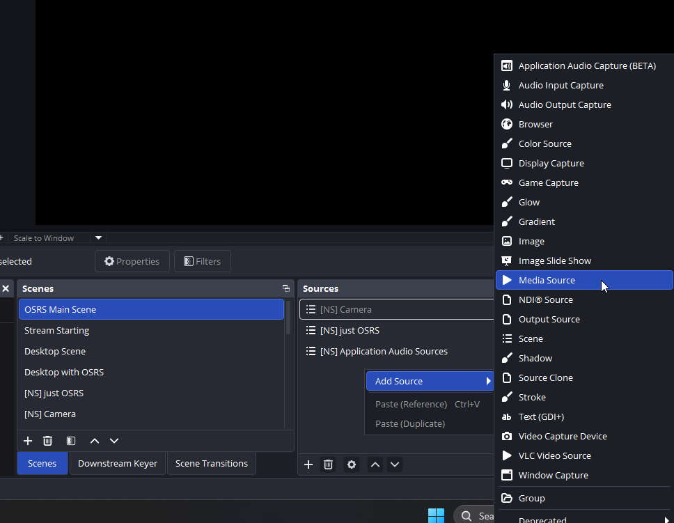
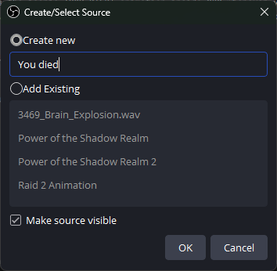
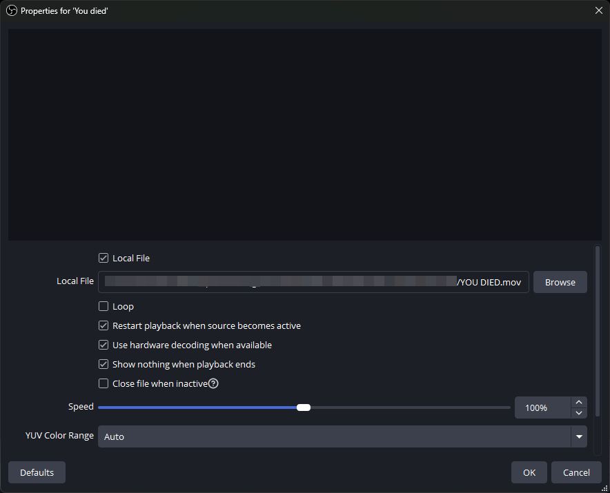

2. As for all alert overlays, make sure this media source is above your RuneLite source. If you want to be able to hear
   this alert, right-click the
   **Audio Mixer** and select `Advanced Audio Properties` and make sure your added media source has 'Monitor and
   Output'
   as the **Audio Monitoring** option. Once that's done, click the eye icon to hide it . You will see later why.

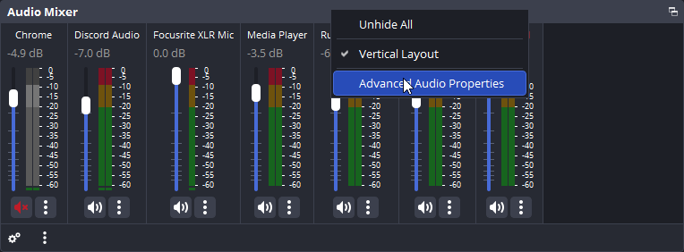

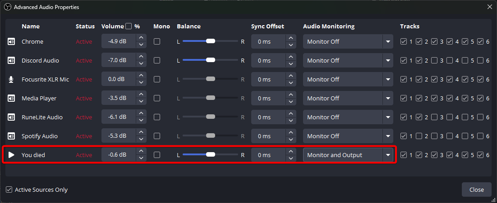

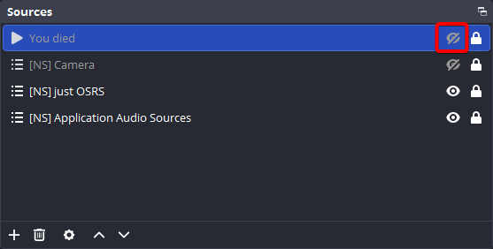

#### In Streamerbot

1. In your Streamerbot application, navigate to ``Actions & Queues > Actions``, right-click the 'Actions' container and 
click `Add`. Give it a name. In our example, we will name it `Death`. Optionally, you can assign it to a group to keep 
it organized.

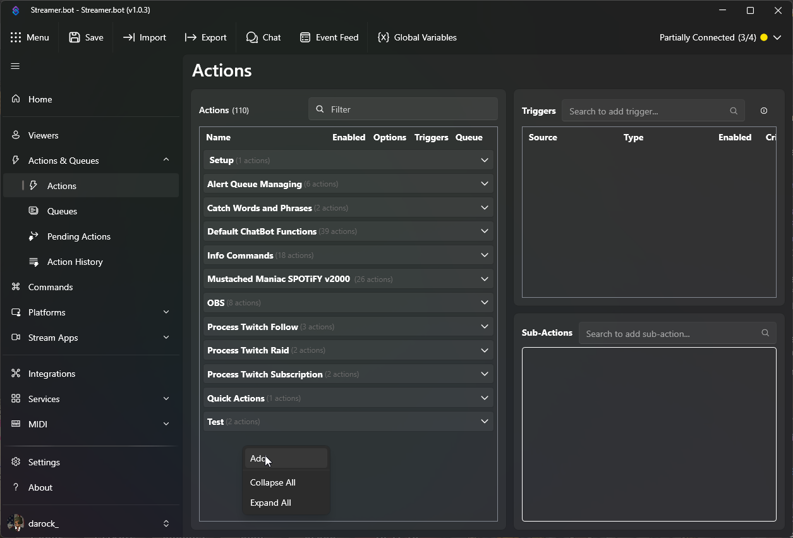
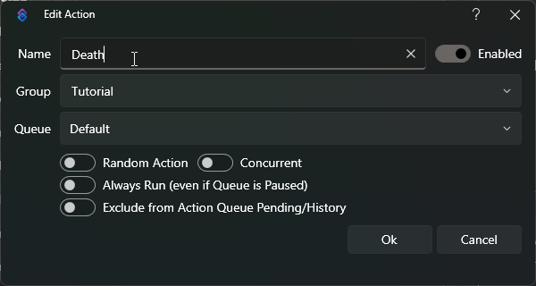

2. Select the action you just made. The 'Sub-Actions' container will list the tasks this action will perform in the
   order shown.
   Here, right-click `Add > Core > Delay` and set it to `600` milliseconds and click 'Ok'. This sub-action simply lets
   Streamerbot wait before performing the next sub-action. In our case, this is to time the animation nicely with
   the in-game death.

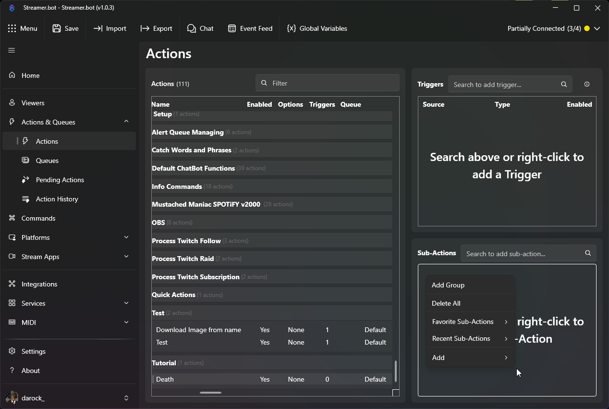
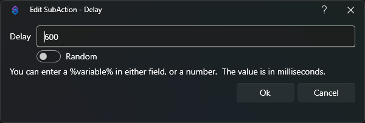

3. Now right-click `Add > OBS Studio > Sources > Set Source Visibility State`. Select your OBS scene where you added
   the media source and then select the source itself, which we named `You died`. Set the state to `Visible` and click '
   Ok'.

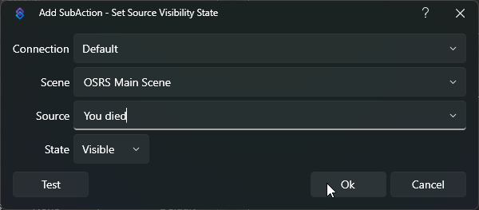

4. Right-click your 'Delay for 600ms' sub-action and select `Duplicate Sub-Action`, which adds another identical
   sub-action at the end of the sequence. Double-click this copy to edit it. Set the delay to `8500` milliseconds and
   click 'Ok'. This second delay is to let the animation play before proceeding. Similarly, duplicate your 'OBS Studio
   Source Visibility State' sub-action and change the state to `Hidden`. You now have created an action which. The
   result should look like in the image below.

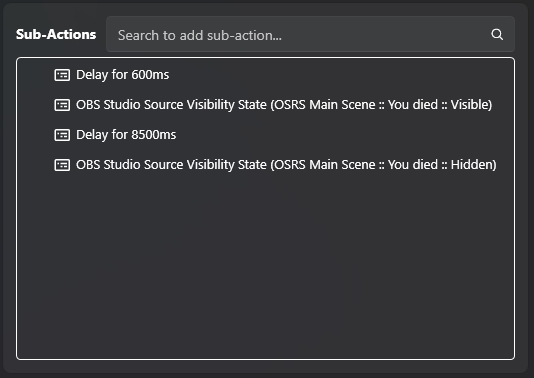

<sub>Don't worry if your scene and source are named differently.</sub>

You now have created a Streamerbot action that 
- waits 600 ms
- makes a media source visible, which automatically plays the media file
- waits another 8500 ms to let it play
- hides the media source again

#### In RuneLite

1. Ensure Dink and the Streamerbot plugin are installed from the Plugin Hub and enabled.

2. In your RuneLite settings go to `Streamerbot > Dink notifications > Enable death` and checkmark this setting. This
   will automatically enable the corresponding notifier in Dink. below, copy the name of the action you created, which
   in our example was `Death`.
   By default, Dink's death notifier will ignore safe deaths. If you do want the alert to play on safe death, go to
   `Dink > Death > Ignore Safe Deaths` and uncheck this setting. In this section, you can customize exactly when the
   death notifier fires. Some of these settings, such as `Send Image` and `Embed Kept Items` can be ignored, as they're
   only relevant for sending notifications to Discord webhooks with Dink.

Your death alert should now be ready to use! The result should look like this in OBS Studio.

[](https://www.youtube.com/watch?v=0YfdTtCFP4Q)

</details>

### Notification Data from RuneLite

When a notifier fires, data relevant to the in-game event is sent alongside the notification to Streamerbot. In the
spirit of Streamerbot, we shall refer to the data as 'variables'. All notifiers will send the variables
`notificationType` indicating the type of event, `playerName`, `accountType` and
`plainText`, which is the message configured within Dink, besides their individual set of variables.
For example, on player death the death notifier sends the integer `valueLost`, indicating how much wealth
in gp the player lost. It also sends the boolean `isPvp`, which has the value `true` if another player killed the user
and `false` otherwise, and the string `killerName`, indicating who or what npc killed you (when applicable),
among other variables.

On certain events, some variables cannot have a meaningful value. For example if your character dies without being
killed by a player or npc, `killerName` will simply have the value `"N/A"`. Other nullable string variables will also
have this behavior. For int and long variables the placeholder value will be `0`. For doubles, it 
is `0.0`.

For a full overview of the variables that are sent with each notifier, see
Dink's [**JSON examples**](https://github.com/pajlads/DinkPlugin/blob/master/docs/json-examples.md). Of each notifier, its
unique dataset is contained inside `"extra"`.

#### Variables in Streamerbot

After Streamerbot performs an action, you can look at the variables that came with the event that triggered it. 
In Streamerbot, go to `Actions & Queues > Action History` and double-click the past action you want to inspect. This 
shows a list of variables and their values that come with the event. After the Streamerbot plugin sends a notification 
to Streamerbot, this is where you can see all the aforementioned notification data.

#### Using variables

You can use these variables to get really creative! Most sub-actions with configuration text fields can be fed values 
of variables. To do this, wrap the variable name with `%`, as follows: `%variableName%`. For a complete guide on 
variables in Streamerbot, [**click here**](https://docs.streamer.bot/guide/variables). 

### Example notifier with variables

<details>

<summary>Click here to open the tutorial</summary>

If this all seems very technical because you're not a programmer, don't worry; it's easier than it looks. Assuming Dink, 
the Streamerbot plugin and Streamerbot are set up, we will use the Death notifier again as we did in 
[**Example Notifier**](#example-notifier). **Note**: For this specific example you must have your Twitch account connected 
to Streamerbot. See the [**Twitch Setup**](https://docs.streamer.bot/get-started/setup#twitch-setup) if you still need to do this. 

1. If you haven't made the notifier from [**Example Notifier**](#example-notifier), follow step 1. of the
[**Streamerbot**](#in-streamerbot) part. If you did, ignore this step.

2. Select the action that you've made, right-click the sub-action container and go to
   `Add > Twitch > Chat > Send Message to Channel`.
   Copy the following into the text field and click 'Ok'.

```
%playerName% just died to %killerName% and lost %valueLost% gp. Sit!
```

3. If you've already made the death alert from the first example, drag this sub-action to the top of the list. It this 
case, it should look like in the image below. 

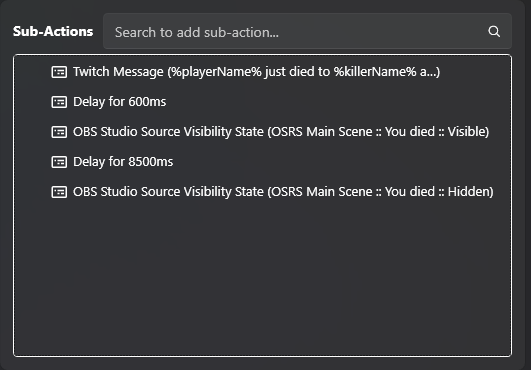

4. Follow steps 1. and 2. of the [**RuneLite**](#in-runelite) part if you haven't made the death alert.

Whenever your character dies to an NPC or player, it will now be sent to your Twitch Chat by either your 
Twitch broadcaster account or your bot account that you configured in Streamerbot.

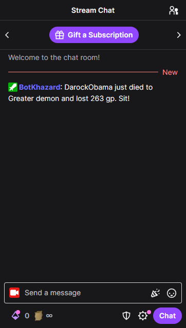

</details>

## Credits and Attribution
This project would not have been possible without [**Dink**](https://github.com/pajlads/DinkPlugin/tree/master) and the
help of its amazing developers. The current functionality of this plugin fully relies on the outbound `PluginMessage`
feature from Dink. Furthermore, this project uses code adapted from Dink Plugin.